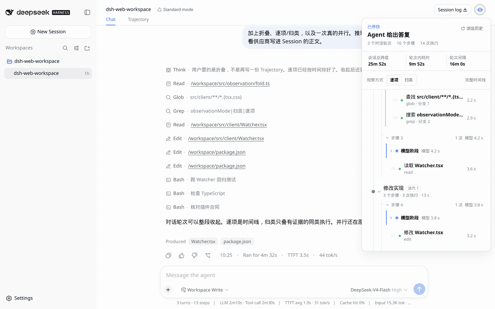
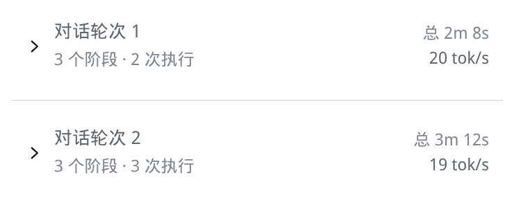
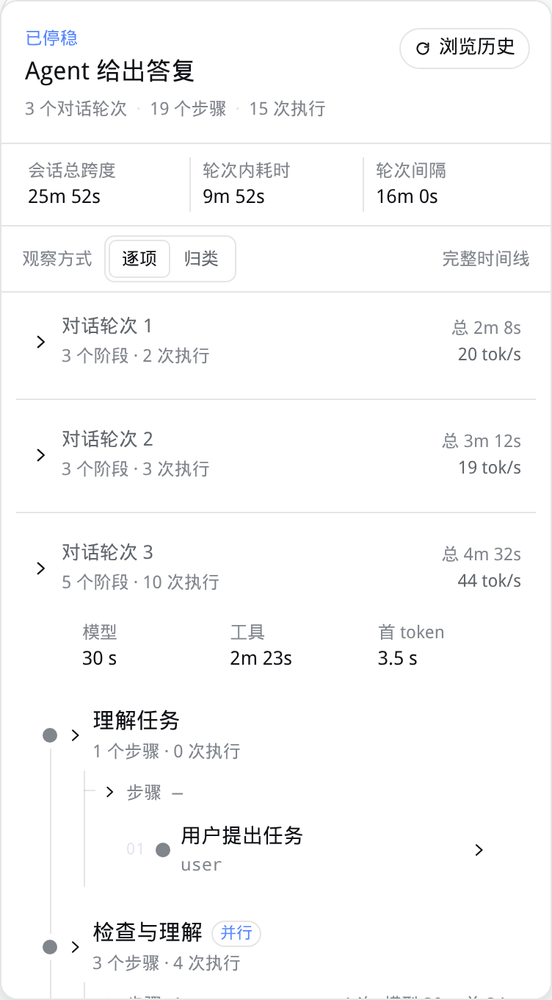
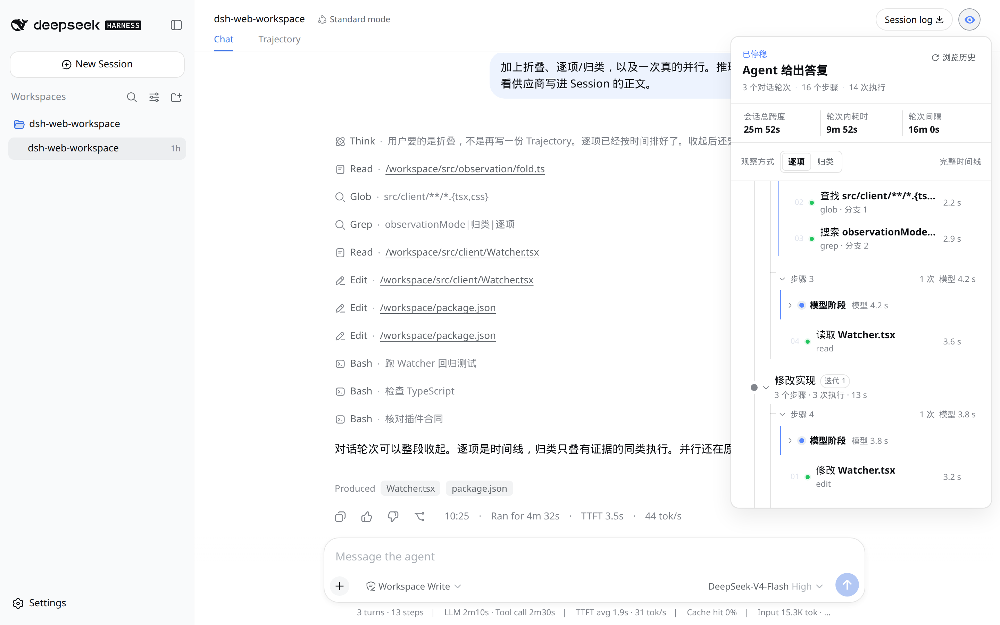
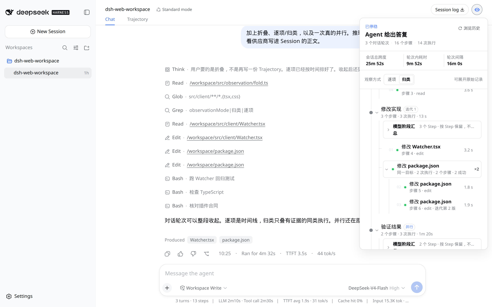

[中文](./README.md) · English

# Watcher

A read-only plugin for DeepSeek Harness Web. Open the eye in the session header. A Session becomes a foldable work path: how many steps ran, how many tools fired, how long it took. Open a step for parallel branches, a tool result, or a reasoning row that stays folded until you ask.

It does not inject messages, invent hidden chain-of-thought, or replace the official Trajectory.











Grouped view only stacks what it can prove. Two different bash calls stay apart. The model stage shows only provider-visible reasoning already written into the Session. If nothing was recorded, it says so.

## Install

```sh
dsh plugin --profile web add github:aa2246740/dsh-watcher
```

Or from a clone:

```sh
git clone https://github.com/aa2246740/dsh-watcher.git
dsh plugin --profile web add ./dsh-watcher
```

Then restart that DSH Host and reload the page. `dsh plugin add` writes the profile. It does not hot-load a running Host.

```sh
dsh plugin --profile web remove dsh-watcher
```

DeepSeek Harness `0.1.5-rc.1`. Node `^22.19.0` or `>=24`.

The interaction contract lives in [DESIGN.md](./DESIGN.md). MIT.

## Build from source

Use a prepared DSH 0.1.5-rc.1 checkout. The plugin may live outside the Harness tree.

```sh
node scripts/link-harness-dependencies.mjs /path/to/harness
DSHX_HARNESS=/path/to/harness npm run build
npm test
```

`tsdown.config.ts` restates the two 0.1.5 artifact contracts for an out-of-tree
plugin (Host half plus the `window.__ModuleLoader__.load` client bundle) and
reads the platform module table from the Harness at build time; the Harness no
longer ships the external `tools/dshx` adapter.

Watcher waits for the Chat projection on cold sessions before mounting its panel.
