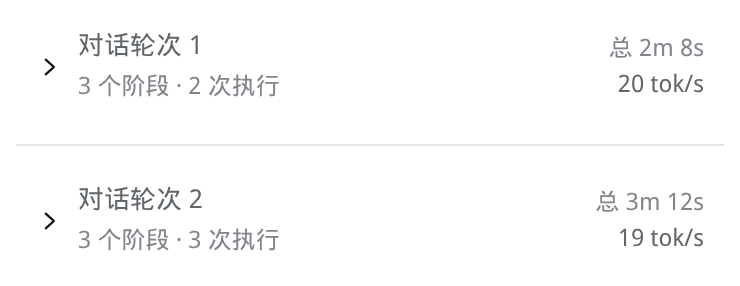
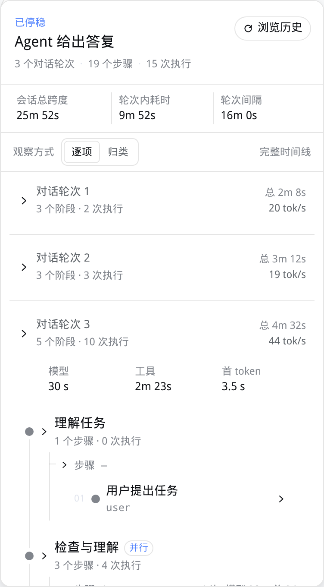
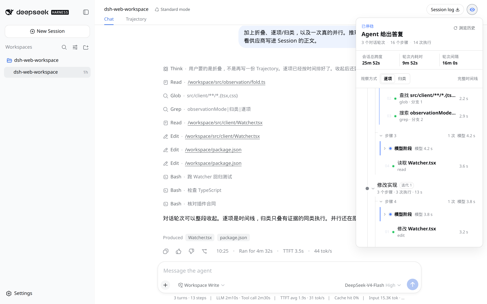
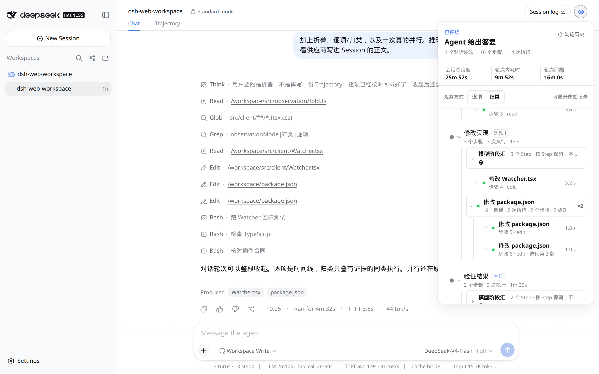

中文 · [English](./README.en.md)

# Watcher

[](https://www.npmjs.com/package/dsh-watcher)

## 安装 / 更新

### 在 DeepSeek Harness 网页版或桌面端安装

在 **添加插件** 向导的搜索框中填入 `dsh-watcher`，点击 **Install**：


### 使用 `dsh` 命令行安装

从 [DeepSeek Harness](https://www.npmjs.com/package/@deepseek-ai/dsh) 安装 [`dsh-watcher`](https://www.npmjs.com/package/dsh-watcher) 插件：

```sh
dsh plugin --profile web add dsh-watcher
```

更新 `dsh-watcher` 插件：

```sh
dsh plugin --profile web update dsh-watcher@latest
```

然后用 `dsh web` 启动 Web 界面。无需构建、无需重启。

这条官方 CLI 命令只写入 `web` profile，不能修改 Desktop App 的 profile；桌面端请使用上面的应用内“添加插件”向导。本发布已提交 `lib/`；普通使用不需要 clone、构建或安装 DSHX。

需要 DeepSeek Harness **0.2.0-rc.2**（`@deepseek-ai/dsh@0.2.0-rc.2`，`dsh-v0.2.0-rc.2`）。`@deepseek-ai/dsh-*` 的 peer 范围是 `>=0.2.0-rc.1 <0.2.1`：接受 **0.2.0-rc.2** 和稳定版 **0.2.0**，拒绝 alpha，也拒绝 **0.1.7-rc.2**。Node `^22.19.0` 或 `>=24`。

DeepSeek Harness Web 的只读插件。点会话标题栏里的眼睛，把 Session 收成一张能折叠的工作路径：这轮走了几步、跑了几次、花了多久；再展开某一步看并行分支、工具结果，或一条默认折着的推理记录。

它不往对话里塞消息，不编隐藏思维链，也不替代官方 Trajectory。










归类只叠能证明相同的调用。两条不同的 bash 不会被捏在一起。模型阶段只显示供应商已经写进 Session 的可见 reasoning；没有记录就写未记录。

### 高级安装方式

固定到某个 GitHub 标签：

```sh
dsh plugin --profile web add github:aa2246740/dsh-watcher#v0.7.0
```

已经 clone 过的目录也可以（开发/本地测试）：

```sh
git clone https://github.com/aa2246740/dsh-watcher.git
dsh plugin --profile web add ./dsh-watcher
```

同样需要 pnpm，然后重新打开该 Web Host 并刷新页面。

```sh
dsh plugin --profile web remove dsh-watcher
```

官方 CLI 只管理 `web` profile；Desktop App 请使用上面的应用内“添加插件”入口。

设置页和会话 HUD 的 Token 总数旁有 **估算费用**（不是「总价值」）。按模型的输入 / 输出 / 缓存桶对照 `pricing/models.yaml` 计价；缺行显示 **未知**，不会当成 $0。部分已知时主数字只显示已标价金额，未标价写在脚注。这是估算，不是账单。默认表含 DeepSeek、MiniMax、OpenAI、Anthropic、Gemini、Grok、GLM、Qwen 主流行，不联网。设置里打开的是当前生效价格表；保存只把改动过的行写入 `localStorage` 键 `dsh-watcher:pricing-override:v1`。欢迎对默认表提 PR。

交互约定在 [DESIGN.md](./DESIGN.md)。MIT。

## 本次更新（0.7.0）

- 对齐官方 DeepSeek Harness **0.2.0-rc.2**（`dsh-v0.2.0-rc.2`，SHA `639ed015397290b3745d163aafe02ffee4aa3f84`）。`@deepseek-ai/dsh-*` 的 peer 是 `>=0.2.0-rc.1 <0.2.1`：接受 `0.2.0-rc.2` 和稳定版 `0.2.0`，拒绝 alpha，也拒绝 `0.1.7-rc.2`。
- 图标仍是 `IconChevronRightOutlineRegular`、`IconRefreshOutlineRegular`、`IconCheckOutlineRegular`、`IconCopyOutlineRegular`。这四个名字在 `dsh-v0.2.0-rc.2` 的 primitives 里还在。带尺寸后缀的旧导出仍然没有。

## 0.6.1

- 在官方 DeepSeek Harness **0.1.7-rc.2** 上核对通过。`@deepseek-ai/dsh-*` 的 peer 仍是 `>=0.1.7-rc.1 <0.1.8`，安装期接受 `0.1.7-rc.1` 和 `0.1.7-rc.2`，不接受 `0.1.7-alpha.*`。
- 图标仍是 `IconChevronRightOutlineRegular`、`IconRefreshOutlineRegular`、`IconCheckOutlineRegular`、`IconCopyOutlineRegular`。rc.2 同样没有带尺寸后缀的旧导出。

## 0.6.0

- 对齐官方 DeepSeek Harness **0.1.7-rc.1**。`@deepseek-ai/dsh-*` 的 peer 改为 `>=0.1.7-rc.1 <0.1.8`，安装期接受 `0.1.7-rc.1`，不接受 `0.1.7-alpha.*`。
- 图标改为 `IconChevronRightOutlineRegular`、`IconRefreshOutlineRegular`、`IconCheckOutlineRegular`、`IconCopyOutlineRegular`。rc.1 删掉了带尺寸后缀的旧导出，没有别名。

## 0.5.0

- **面板能拖大。** 右边缘、下边缘和右下角把手都能拖；位置全程不动，最小只能缩回打开时的默认尺寸，不会小到放不下内容。
- **HUD 可折叠成一行。** 范围切换旁多了一个 `▾`，收起只留顶栏统计，选择会被记住。
- **"定位现场"真的到现场。** 现在会选中告警对应的具体失败步骤、直接打开检视器，而不是只滚到轮次标题。
- **连续失败不再刷屏。** 同一条失败链更新同一张卡片，标题带上 `第 N 轮`。

外加一串 0.4.5 的修复：检视器返回不再抢跟随、首次选范围不重复扫会话、投影状态不再存一份自身视图、计时面板文案改为"终端以外的工具"。

历史版本见 [CHANGELOG.md](./CHANGELOG.md)。

## 从源码构建

日常安装不用这一步。改 TypeScript 后用 **pnpm** 重建已提交的 `lib/`：

```sh
pnpm install
pnpm test
node scripts/link-harness-dependencies.mjs /path/to/harness
pnpm build
```

`pnpm build` 需要能解析 `@deepseek-ai/dsh-*` peer 的本机 Harness 检出。装插件不要走这条路径。

冷会话的 Chat 数据尚未到达时，Watcher 显示等待提示，数据到达后再挂载面板。
